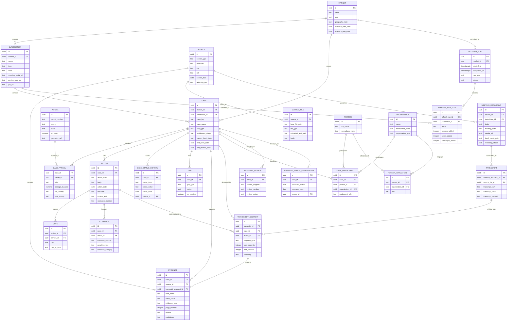
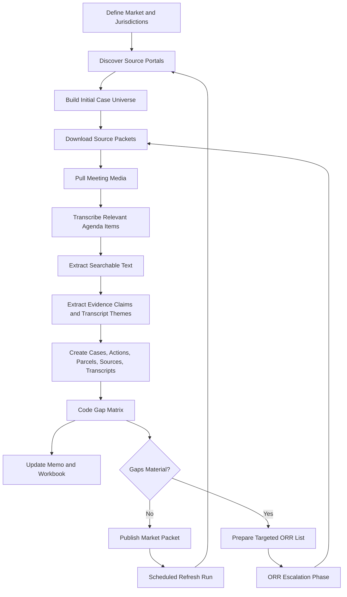
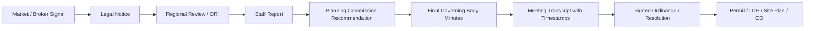

# Entitlement Intelligence Data Model

Purpose: define a sustainable database-oriented model for a growing zoning and industrial-entitlement portfolio. The model supports countywide markets, municipalities, projects, parcels, actions, sources, meeting recordings, transcripts, evidence extracts, people, organizations, refresh runs, and gap tracking.

Recommended top-level hierarchy:

`Market > Jurisdiction > Case > Parcel / Action / Source / Evidence`

This keeps the market thesis readable while preserving enough granularity to support parcel-level underwriting and future database queries.

## Core Design Principles

- Store facts once, then connect them through relationship tables.
- Treat a case as the entitlement workstream, not as a parcel and not as a development project.
- Treat a parcel as a spatial/legal object that may appear in multiple cases over time.
- Treat a source as a document or webpage.
- Treat meeting recordings and transcripts as source-backed records that explain hearing discussion without replacing final action records.
- Treat transcript segments as timestamped, citeable evidence units.
- Treat evidence as a specific extracted claim from a source.
- Treat actions as official process events, such as Planning Commission recommendation or City Council final approval.
- Treat people and organizations as participants with roles in cases/actions.
- Treat gaps as first-class records so uncertainty can be managed, not buried in prose.

## Entity Relationship Diagram



## Workflow / Data Lineage Diagram



## Evidence Confidence Ladder



Higher on the ladder does not erase lower evidence. It changes the claim type that can be made.

For example:

- Broker listing can support `market signal`.
- Legal notice can support `hearing noticed`.
- DRI can support `regional review complete`.
- Transcript segments can support `discussion theme`, `public concern`, `applicant representation`, or `condition negotiation`.
- Council minutes can support `final local approval verified`.
- Permit/CO can support `construction/occupancy status`.

## Recommended Tables

### markets

One row per investment/research geography.

Key fields:

- `id`
- `name`
- `slug`
- `state`
- `geography_note`
- `research_start_date`
- `research_end_date`
- `created_at`
- `updated_at`

### jurisdictions

One row per city, county, town, regional body, or authority.

Key fields:

- `id`
- `market_id`
- `name`
- `jurisdiction_type`
- `state`
- `county`
- `meeting_portal_url`
- `zoning_code_url`
- `comprehensive_plan_url`
- `gis_url`
- `permit_portal_url`
- `orr_url`

### cases

One row per entitlement/development workstream.

Key fields:

- `id`
- `market_id`
- `jurisdiction_id`
- `case_key`
- `case_name`
- `project_aliases`
- `use_type`
- `submarket_or_corridor`
- `scale_summary`
- `entitlement_stage`
- `verified_outcome`
- `current_best_status`
- `first_seen_date`
- `last_verified_date`

### parcels

One row per parcel identifier.

Key fields:

- `id`
- `parcel_number`
- `county`
- `state`
- `acreage`
- `owner_name_current`
- `geometry_ref`
- `gis_url`

### case_parcels

Many-to-many join between cases and parcels.

Key fields:

- `case_id`
- `parcel_id`
- `role`
- `acreage_in_case`
- `pre_zoning`
- `post_zoning`
- `pre_flum`
- `post_flum`

### actions

One row per public process event.

Key fields:

- `id`
- `case_id`
- `jurisdiction_id`
- `action_type`
- `body`
- `action_date`
- `outcome`
- `vote_summary`
- `motion_text`
- `ordinance_number`
- `resolution_number`
- `hearing_url`

Action types:

- `legal_notice`
- `staff_report`
- `planning_commission`
- `city_council`
- `county_commission`
- `annexation`
- `rezoning`
- `conditional_use`
- `variance`
- `site_plan`
- `ldp`
- `building_permit`
- `certificate_of_occupancy`
- `development_agreement`
- `withdrawal`
- `denial`

### votes

Optional detail table for votes.

Key fields:

- `id`
- `action_id`
- `person_id`
- `vote`
- `role_at_time`

### conditions

One row per approval condition.

Key fields:

- `id`
- `case_id`
- `action_id`
- `condition_number`
- `condition_text`
- `condition_category`
- `responsible_party`

Condition categories:

- `traffic`
- `access`
- `buffer`
- `landscape`
- `stormwater`
- `environmental`
- `utility`
- `site_plan`
- `operations`
- `hours`
- `lighting`
- `noise`
- `plat`
- `development_agreement`

### sources

One row per unique document/page/source.

Key fields:

- `id`
- `source_type`
- `publisher`
- `title`
- `url`
- `source_date`
- `retrieved_at`
- `reliability_tier`
- `local_file_path`
- `hash`

Source types:

- `agenda`
- `agenda_packet`
- `staff_report`
- `minutes`
- `ordinance`
- `resolution`
- `legal_notice`
- `meeting_archive_page`
- `meeting_audio`
- `meeting_video`
- `transcript`
- `regional_review`
- `permit_record`
- `gis_record`
- `developer_page`
- `broker_listing`
- `trade_press`

### source_files

One row per locally stored source artifact or derivative.

Use this when one source has multiple file representations, such as a downloaded PDF, rendered page images, extracted text, OCR output, or archived HTML.

Key fields:

- `id`
- `source_id`
- `local_file_path`
- `file_type`
- `mime_type`
- `extracted_text_path`
- `hash`
- `created_at`

### meeting_recordings

One row per public meeting audio/video recording or archive entry.

Use this table for planning commission, city council, county commission, zoning board, development authority, or other hearing bodies where case discussion may appear.

Key fields:

- `id`
- `source_id`
- `jurisdiction_id`
- `body`
- `meeting_date`
- `agenda_url`
- `media_url`
- `local_media_path`
- `recording_status`
- `retrieved_at`
- `duration_seconds`

Recording statuses:

- `downloaded`
- `url_preserved`
- `stream_only`
- `unavailable`
- `broken_link`
- `orr_needed`

### transcripts

One row per transcript generated from or attached to a meeting recording.

Key fields:

- `id`
- `meeting_recording_id`
- `source_file_id`
- `transcript_path`
- `transcript_status`
- `transcript_method`
- `language`
- `created_at`

Transcript statuses:

- `complete`
- `partial_case_segments_only`
- `failed_audio_quality`
- `media_unavailable`
- `needs_review`

### transcript_segments

One row per timestamped discussion segment that matters to a case.

Use this as the bridge between raw transcript text and entitlement intelligence. A single meeting transcript may generate many case-linked segments.

Key fields:

- `id`
- `transcript_id`
- `case_id`
- `action_id`
- `segment_type`
- `speaker_name`
- `speaker_role`
- `start_seconds`
- `end_seconds`
- `excerpt`
- `summary`
- `theme_tags`
- `confidence`

Segment types:

- `staff_presentation`
- `applicant_presentation`
- `public_comment_support`
- `public_comment_opposition`
- `official_discussion`
- `condition_negotiation`
- `motion`
- `vote`

Reliability tiers:

- `official_final_action`
- `official_staff_packet`
- `official_regional_review`
- `official_map_or_gis`
- `legal_notice`
- `developer_or_contractor`
- `trade_press`
- `market_listing`
- `secondary_reporting`

### evidence

One row per extracted claim.

Key fields:

- `id`
- `case_id`
- `source_id`
- `action_id`
- `transcript_segment_id`
- `field_name`
- `claim_value`
- `evidence_note`
- `page_number`
- `locator`
- `confidence`
- `extracted_at`

Field examples:

- `original_zoning`
- `requested_zoning`
- `final_zoning`
- `flum`
- `character_area`
- `acreage`
- `square_feet`
- `applicant`
- `landowner`
- `staff_recommendation`
- `planning_commission_action`
- `final_action`
- `conditions`
- `current_status`

### case_status_history

One row per coded status change or verification state for a case.

Use this for durable status history instead of overwriting the case every time a new source is found. The `cases.current_best_status` field should hold the latest rollup for reporting, while this table preserves the underlying sequence.

Key fields:

- `id`
- `case_id`
- `status_type`
- `status_value`
- `status_date`
- `source_id`
- `note`
- `created_at`

Status types:

- `entitlement`
- `development`
- `gap_resolution`
- `research_quality`

### refresh_runs

One row per scheduled or ad hoc refresh of a market packet.

Key fields:

- `id`
- `market_id`
- `started_at`
- `completed_at`
- `run_type`
- `cadence`
- `status`
- `summary`
- `next_scheduled_at`

Run types:

- `scheduled_monthly`
- `scheduled_quarterly`
- `weekly_hearing_window`
- `ad_hoc_signal`
- `orr_follow_up`

### refresh_run_items

One row per jurisdiction checked during a refresh run.

Key fields:

- `id`
- `refresh_run_id`
- `jurisdiction_id`
- `checked_from_date`
- `checked_through_date`
- `result`
- `sources_added`
- `cases_added`
- `cases_changed`
- `transcripts_added`
- `gaps_closed`
- `orr_candidates_added`
- `note`

### participants

Use `people`, `organizations`, and `case_participants` rather than storing names only in case rows.

Case participant fields:

- `case_id`
- `person_id`
- `organization_id`
- `participant_role`
- `source_id`
- `confidence`

Roles:

- `applicant`
- `developer`
- `landowner`
- `zoning_counsel`
- `civil_engineer`
- `traffic_engineer`
- `staff_presenter`
- `planning_commissioner`
- `council_member`
- `county_commissioner`
- `public_speaker_support`
- `public_speaker_opposition`
- `broker`
- `contractor`
- `utility_provider`

### gaps

One row per open verification need.

Key fields:

- `id`
- `case_id`
- `gap_type`
- `gap_description`
- `priority`
- `status`
- `next_action`
- `orr_required`
- `created_at`
- `resolved_at`

Gap types:

- `original_zoning`
- `flum_character`
- `staff_report`
- `planning_commission_action`
- `final_action`
- `conditions`
- `site_plan`
- `permit`
- `certificate_of_occupancy`
- `development_agreement`
- `utility`
- `traffic`
- `current_status`
- `source_quality`

## Stable Case ID Convention

Use:

```text
{MARKET}-{YEAR}-{JURISDICTION}-{SHORTNAME}
```

Examples:

- `JC-2024-COMMERCE-TAYLOR`
- `FB-2025-4627`
- `JC-2026-ORCHID`

IDs should remain stable even if project names change.

## Query Examples The Model Should Support

- Show all final local approvals for M-1 or LI industrial uses in a market.
- Show all DRI-complete cases without final local action.
- Show all cases involving truck terminals, truck stops, or diesel fueling.
- Show all conditions involving road improvements or buffers.
- Show all projects where original zoning was agricultural and final zoning was industrial.
- Show all active gaps requiring ORR escalation.
- Show all cases where a specific developer, counsel, or landowner appears.
- Show all approvals in a given municipality during a date window.

## Migration Path From Current CSVs

Current CSV to database mapping:

- findings CSV -> `cases`, `case_status_history`, selected `evidence`
- gap matrix CSV -> `gaps`
- key players CSV -> `people`, `organizations`, `case_participants`
- source audit CSV -> `sources`
- meeting ledger CSV -> `actions`, `sources`, `source_files`, `meeting_recordings`
- extracted text files -> `source_files`, optionally searchable document store
- transcript files -> `transcripts`, `transcript_segments`, selected `evidence`
- refresh logs -> `refresh_runs`, `refresh_run_items`, `case_status_history`

Do not throw away CSVs immediately. Keep them as export/reporting artifacts generated from the database once the database exists.
